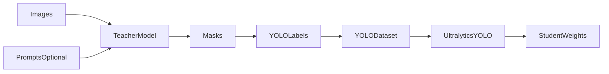

# visiondistill

`visiondistill` uses foundation vision models such as `SAM2` and `SAM3` to generate pseudo-labels, then trains smaller Ultralytics YOLO models on that data.

Current focus: segmentation distillation. Detection support can be added later through the same pipeline structure.

## What It Does

- Loads teacher weights from Hugging Face or a local path
- Supports `sam2` and `sam3`
- Generates segmentation masks from prompts or automatic mask generation
- Converts masks to YOLO segmentation labels
- Builds a YOLO `train/` and `val/` dataset
- Trains a student model such as `yolov8n-seg.pt`

## How It Works




## Install

Local development:

```bash
pip install -e .
```

With dev tools:

```bash
pip install -e ".[dev]"
```

Install directly from GitHub:

```bash
pip install git+https://github.com/yajatvishwak/visiondistill.git
```

## GPU Usage

By default, `device` is set to `"auto"`, which picks the best available backend:

1. NVIDIA CUDA if available
2. Apple Silicon MPS if available
3. CPU as fallback

Both the teacher (SAM) and the student (YOLO) run on the same resolved device. The dtype is also adjusted automatically -- `float16` is only used on CUDA; on MPS and CPU it promotes to `float32`.

### NVIDIA CUDA

Install PyTorch with a CUDA build first:

```bash
pip install torch --index-url https://download.pytorch.org/whl/cu124
```

Verify:

```bash
python -c "import torch; print(torch.cuda.is_available())"
```

Then either let auto-detection handle it, or force CUDA:

```python
PipelineConfig(device="cuda")
```

```bash
visiondistill ./my_images --device cuda
```

### Apple Silicon (MPS)

On macOS with Apple Silicon, MPS is auto-detected. You can also force it:

```python
PipelineConfig(device="mps")
```

```bash
visiondistill ./my_images --device mps
```

### CPU

```python
PipelineConfig(device="cpu")
```

If you request `cuda` or `mps` and it is not available, the pipeline logs a warning and falls back to CPU automatically.

## Quick Start

### Python

```python
from visiondistill import DistillationPipeline, TeacherConfig, StudentConfig, PipelineConfig

pipeline = DistillationPipeline(
    teacher=TeacherConfig(
        model="sam3",
        weights="facebook/sam3",
        prompt_type="text",
    ),
    student=StudentConfig(
        model="yolov8n-seg.pt",
        epochs=100,
        imgsz=640,
    ),
    config=PipelineConfig(
        output_dir="./runs/distill",
        val_split=0.2,
        device="auto",
    ),
)

pipeline.run(
    images_dir="./my_images",
    prompts="car",
    class_names=["car"],
)
```

### CLI

```bash
visiondistill ./my_images \
    --teacher-model sam3 \
    --prompt-type text \
    --prompt car \
    --student-model yolov8n-seg.pt \
    --epochs 100 \
    --device cuda
```

Per-image prompts can also be passed with `--prompts-json`.

## Supported Teachers


| Teacher | Prompt types                                | Default weights               |
| ------- | ------------------------------------------- | ----------------------------- |
| `sam2`  | `auto`, `points`, `boxes`                   | `facebook/sam2.1-hiera-large` |
| `sam3`  | `text`, `image_exemplar`, `boxes`, `points` | `facebook/sam3`               |


Examples:

```python
TeacherConfig(model="sam3", weights="facebook/sam3")
TeacherConfig(model="sam3", weights="/path/to/local/sam3")
```

## Common Usage Modes

Full pipeline:

```python
pipeline.run(...)
```

Annotation only:

```python
pipeline.annotate_only(...)
```

Training only:

```python
pipeline.train_only(...)
```

## Project Structure

```text
visiondistill/
├── __init__.py
├── cli.py
├── config.py
├── pipeline.py
├── teachers/
├── students/
├── data/
└── utils/
```

- `config.py`: teacher, student, and pipeline config
- `pipeline.py`: end-to-end orchestration
- `teachers/`: SAM integrations
- `students/`: Ultralytics student wrapper
- `data/`: annotation conversion and dataset building
- `utils/`: small helpers

## Output Layout

```text
runs/distill/
├── raw_labels/
├── dataset/
│   ├── data.yaml
│   ├── train/
│   └── val/
└── train/
```

## License

This repository is `MIT` licensed. It currently depends on `ultralytics`, which is licensed separately under `AGPL-3.0` unless you have a commercial Ultralytics license.