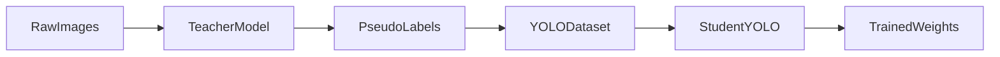
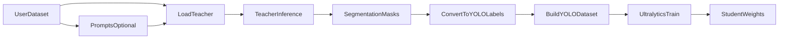
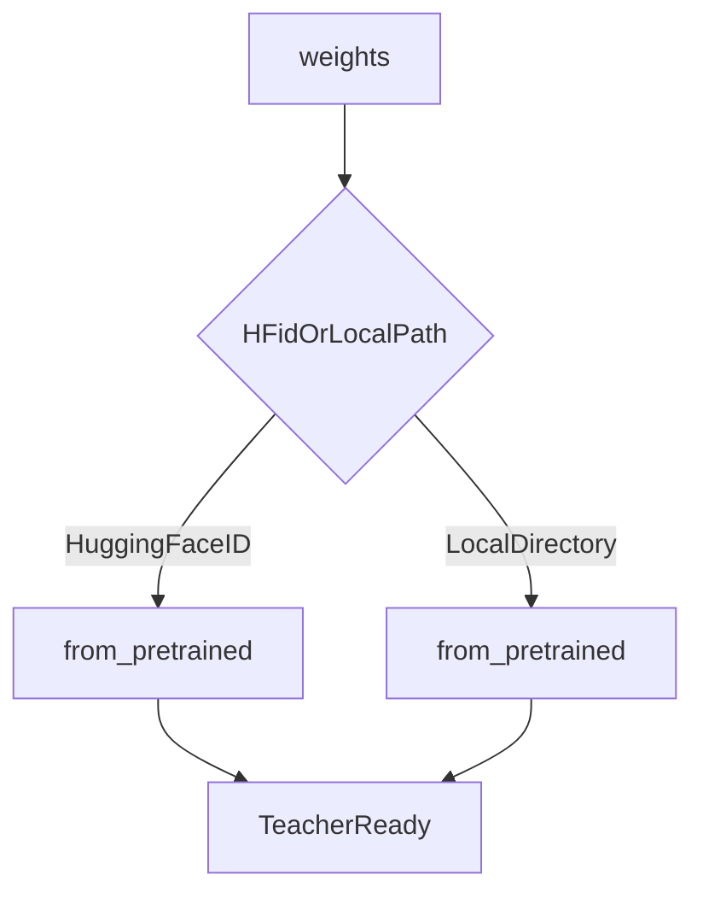
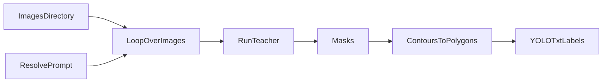
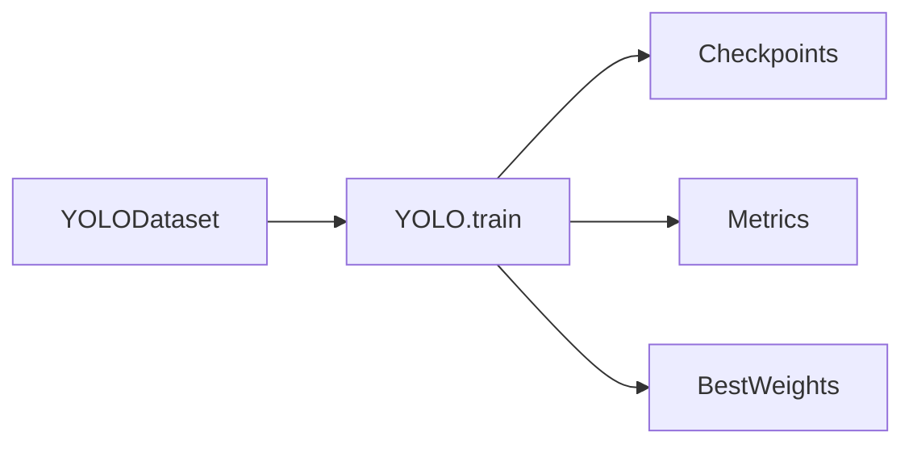
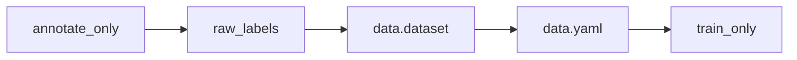

# visiondistill

`visiondistill` is a Python package for using large vision foundation models as teachers and smaller Ultralytics YOLO models as students.

Right now the main use case is segmentation:

1. You give the package a dataset of images.
2. A teacher model such as `SAM2` or `SAM3` generates masks.
3. Those masks are converted into YOLO labels.
4. Ultralytics trains a smaller student model such as `yolov8n-seg.pt`.

The long-term goal is to support detection distillation too, but the current implementation is centered around segmentation.

## What This Project Can Do

- Load a teacher model from Hugging Face.
- Load a teacher model from a local offline weights directory.
- Use `SAM2` or `SAM3` as the teacher.
- Support prompt-based segmentation workflows.
- Generate pseudo-labels from raw images.
- Convert masks into YOLO segmentation polygon labels.
- Build a train/val YOLO dataset automatically.
- Train a small Ultralytics student model.
- Run the whole pipeline at once or one step at a time.

## Beginner-Friendly Overview

If you are new to this idea, think of `visiondistill` as a bridge between a very strong model and a very practical model.

- The strong model is the teacher.
- The practical model is the student.
- The teacher makes labels for your data.
- The student learns from those labels.

That means you can start with raw images and end with a trained YOLO model.



## End-to-End Flow

This is the main flow of the project.



## Teacher Loading Flow

The same `weights` field supports both online and offline usage.



Examples:

```python
TeacherConfig(model="sam3", weights="facebook/sam3")
TeacherConfig(model="sam3", weights="/path/to/local/sam3")
```

## Annotation Flow

This is the pseudo-label generation step.



## Training Flow

This is the student training step.



## Step-by-Step Flow

You do not have to run everything in one command.



## Installation

### Local development install

```bash
pip install -e .
```

With development tools:

```bash
pip install -e ".[dev]"
```

### Install after publishing

After this package is published to PyPI, users will be able to run:

```bash
pip install visiondistill
```

That command only works after:

- the package is uploaded to PyPI
- the package name `visiondistill` is available

## Quick Start

### Simplest Python example

This applies the same prompt to every image.

```python
from visiondistill import DistillationPipeline, TeacherConfig, StudentConfig, PipelineConfig

pipeline = DistillationPipeline(
    teacher=TeacherConfig(
        model="sam3",
        weights="facebook/sam3",
        prompt_type="text",
    ),
    student=StudentConfig(
        model="yolov8n-seg.pt",
        epochs=100,
        imgsz=640,
    ),
    config=PipelineConfig(
        output_dir="./runs/distill",
        val_split=0.2,
        device="cuda",
    ),
)

pipeline.run(
    images_dir="./my_images",
    prompts="car",
    class_names=["car"],
)
```

### Per-image prompts

Use this when different images need different prompt values.

```python
pipeline.run(
    images_dir="./my_images",
    prompts={
        "img1.jpg": ["car", "truck"],
        "img2.jpg": "person",
    },
    class_names=["car", "truck", "person"],
)
```

### CLI examples

SAM3 with one global prompt:

```bash
visiondistill ./my_images \
    --teacher-model sam3 \
    --prompt-type text \
    --prompt car \
    --student-model yolov8n-seg.pt \
    --epochs 100 \
    --device cuda
```

SAM3 with per-image prompts from JSON:

```bash
visiondistill ./my_images \
    --teacher-model sam3 \
    --prompt-type text \
    --prompts-json prompts.json \
    --student-model yolov8n-seg.pt \
    --epochs 100 \
    --device cuda
```

SAM2 in automatic mode:

```bash
visiondistill ./my_images \
    --teacher-model sam2 \
    --prompt-type auto \
    --student-model yolov8n-seg.pt \
    --epochs 50
```

Example `prompts.json`:

```json
{
  "image1.jpg": ["car", "truck"],
  "image2.jpg": "person"
}
```

## Supported Teachers

| Teacher | Good for | Prompt types | Default weights |
|---|---|---|---|
| `sam2` | General segmentation and automatic mask generation | `auto`, `points`, `boxes` | `facebook/sam2.1-hiera-large` |
| `sam3` | Concept-driven segmentation using text or exemplars | `text`, `image_exemplar`, `boxes`, `points` | `facebook/sam3` |

## Prompt Types

### `auto`

- Only works with `sam2`.
- No prompt is required.
- Good when you want the model to segment everything it can find.

### `text`

- Best suited for `sam3`.
- You pass concepts like `"car"`, `"person"`, or `"red backpack"`.
- Good when you know which objects you want in the final dataset.

### `points`

- You provide positive and negative points.
- Useful for guided segmentation.

### `boxes`

- You provide bounding boxes.
- Useful when you already know the rough object location.

### `image_exemplar`

- Best suited for `sam3`.
- You provide example images of the concept you want to segment.

## Project Structure

```text
visiondistill/
├── __init__.py
├── cli.py
├── config.py
├── pipeline.py
├── teachers/
│   ├── __init__.py
│   ├── base.py
│   ├── sam2.py
│   └── sam3.py
├── students/
│   ├── __init__.py
│   └── yolo.py
├── data/
│   ├── __init__.py
│   ├── annotator.py
│   ├── converter.py
│   └── dataset.py
└── utils/
    ├── __init__.py
    └── io.py
```

### What each file or folder does

- `visiondistill/__init__.py`
  Exposes the public API.

- `visiondistill/cli.py`
  Lets users run the package from the terminal with the `visiondistill` command.

- `visiondistill/config.py`
  Holds config dataclasses for teachers, students, and the pipeline.

- `visiondistill/pipeline.py`
  Runs the main workflow and connects all the pieces together.

- `visiondistill/teachers/`
  Contains all teacher-model integrations.

- `visiondistill/teachers/base.py`
  Defines the common interface every teacher must follow.

- `visiondistill/teachers/sam2.py`
  Implements the `SAM2` teacher.

- `visiondistill/teachers/sam3.py`
  Implements the `SAM3` teacher.

- `visiondistill/students/`
  Contains student-model wrappers.

- `visiondistill/students/yolo.py`
  Wraps Ultralytics YOLO training and prediction.

- `visiondistill/data/`
  Contains the dataset preparation pipeline.

- `visiondistill/data/annotator.py`
  Reads images, resolves prompts, runs the teacher, and writes label files.

- `visiondistill/data/converter.py`
  Converts masks into YOLO polygon annotations.

- `visiondistill/data/dataset.py`
  Builds the YOLO dataset folder layout and `data.yaml`.

- `visiondistill/utils/io.py`
  Small helpers for image and path handling.

## Common Ways To Use It

### Full pipeline

Use this when you want pseudo-labeling and training in one run.

```python
pipeline.run(...)
```

### Annotation only

Use this when you first want to inspect or clean the generated labels.

```python
pipeline.annotate_only(...)
```

### Training only

Use this when you already have a YOLO dataset and just want to train.

```python
pipeline.train_only(...)
```

## Typical Output Layout

```text
runs/distill/
├── raw_labels/
│   ├── image1.txt
│   └── image2.txt
├── dataset/
│   ├── data.yaml
│   ├── train/
│   │   ├── images/
│   │   └── labels/
│   └── val/
│       ├── images/
│       └── labels/
└── train/
    └── ... Ultralytics outputs ...
```

## How To Host This So `pip install visiondistill` Works

To make `pip install visiondistill` work for anyone, publish the package to PyPI.

### 1. Check the package name

Make sure the name `visiondistill` is available on PyPI. If it is already taken, you will need a different name such as `visiondistill-ai`.

### 2. Build the package

Install packaging tools:

```bash
python -m pip install --upgrade build twine
```

Build the wheel and source distribution:

```bash
python -m build
```

This creates files inside `dist/`.

### 3. Create a PyPI account

Create an account at [PyPI](https://pypi.org/).

### 4. Upload to TestPyPI first

This is optional but strongly recommended for a first release.

```bash
python -m twine upload --repository testpypi dist/*
```

### 5. Upload to PyPI

```bash
python -m twine upload dist/*
```

### 6. Install from PyPI

Once uploaded successfully, users can run:

```bash
pip install visiondistill
```

### 7. Recommended release process

For each release:

1. Update the version in `pyproject.toml`.
2. Run `python -m build`.
3. Upload with `twine`.
4. Tag the release in Git.

## Future Directions

- Add detection distillation support.
- Support more dataset formats directly.
- Expose more Ultralytics training controls such as augmentation options.
- Add tests and example notebooks.

## License

MIT
