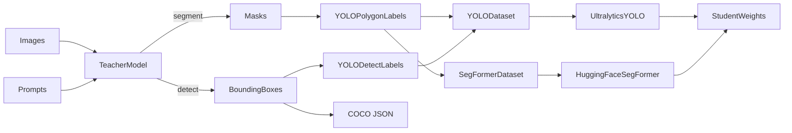

# visiondistill

`visiondistill` uses foundation vision models to generate pseudo-labels, then trains smaller student models on that data. Supports both **segmentation** (SAM2/SAM3 → YOLO-seg / SegFormer) and **detection** (Grounding DINO → YOLO-detect) distillation.

## What It Does

- Loads teacher weights from Hugging Face or a local path
- Supports `sam2`, `sam3`, and `grounding_dino` teachers
- Generates segmentation masks **or** bounding boxes from prompts
- Converts predictions to YOLO labels (polygons or bboxes) or per-pixel PNG masks
- Optionally exports a COCO-format `annotations.json` for detection tasks
- Builds `train/` and `val/` dataset splits
- Trains a student model -- YOLO via Ultralytics or SegFormer via HuggingFace Trainer

## How It Works



## Install

Local development:

```bash
pip install -e .
```

With dev tools:

```bash
pip install -e ".[dev]"
```

Install directly from GitHub:

```bash
pip install git+https://github.com/yajatvishwak/visiondistill.git
```

## GPU Usage

By default, `device` is set to `"auto"`, which picks the best available backend:

1. NVIDIA CUDA if available
2. Apple Silicon MPS if available
3. CPU as fallback

Both the teacher and the student run on the same resolved device. The dtype is also adjusted automatically -- `float16` is only used on CUDA; on MPS and CPU it promotes to `float32`.

### NVIDIA CUDA

Install PyTorch with a CUDA build first:

```bash
pip install torch --index-url https://download.pytorch.org/whl/cu124
```

Verify:

```bash
python -c "import torch; print(torch.cuda.is_available())"
```

Then either let auto-detection handle it, or force CUDA:

```python
PipelineConfig(device="cuda")
```

```bash
visiondistill ./my_images --device cuda
```

### Apple Silicon (MPS)

On macOS with Apple Silicon, MPS is auto-detected. You can also force it:

```python
PipelineConfig(device="mps")
```

```bash
visiondistill ./my_images --device mps
```

### CPU

```python
PipelineConfig(device="cpu")
```

If you request `cuda` or `mps` and it is not available, the pipeline logs a warning and falls back to CPU automatically.

## Quick Start

### Segmentation: YOLO Student (default)

```python
from visiondistill import DistillationPipeline, TeacherConfig, StudentConfig, PipelineConfig

pipeline = DistillationPipeline(
    teacher=TeacherConfig(
        model="sam3",
        weights="facebook/sam3",
        prompt_type="text",
    ),
    student=StudentConfig(
        model="yolov8n-seg.pt",
        epochs=100,
        imgsz=640,
    ),
    config=PipelineConfig(
        output_dir="./runs/distill",
        val_split=0.2,
        device="auto",
    ),
)

pipeline.run(
    images_dir="./my_images",
    prompts="car",
    class_names=["car"],
)
```

### Segmentation: SegFormer Student

```python
from visiondistill import DistillationPipeline, TeacherConfig, StudentConfig, StudentModel, PipelineConfig

pipeline = DistillationPipeline(
    teacher=TeacherConfig(
        model="sam3",
        prompt_type="text",
    ),
    student=StudentConfig(
        student_model=StudentModel.SEGFORMER,
        model="nvidia/mit-b0",       # or "nvidia/mit-b1" through "nvidia/mit-b5"
        num_labels=2,                 # background + 1 class
        epochs=50,
        imgsz=512,
        batch=8,
    ),
    config=PipelineConfig(
        output_dir="./runs/distill_segformer",
        device="auto",
    ),
)

pipeline.run(
    images_dir="./my_images",
    prompts="car",
    class_names=["car"],
)
```

### Detection: Grounding DINO → YOLO

Use `grounding_dino` as the teacher and set `task="detect"`. Class names are automatically used as the detection query -- no separate prompt needed.

```python
from visiondistill import DistillationPipeline, TeacherConfig, StudentConfig, PipelineConfig

pipeline = DistillationPipeline(
    teacher=TeacherConfig(
        model="grounding_dino",
        threshold=0.3,
    ),
    student=StudentConfig(
        task="detect",
        model="yolov8n.pt",          # or yolov9c.pt, yolo11n.pt, etc.
        epochs=100,
        imgsz=640,
    ),
    config=PipelineConfig(
        output_dir="./runs/distill_detect",
        device="auto",
    ),
)

pipeline.run(
    images_dir="./my_images",
    class_names=["car", "truck", "bus"],
)
```

When `task="detect"`, YOLO-normalized bbox labels are written for training and a COCO-format `annotations.json` is saved alongside them.

### CLI

Segmentation (default):

```bash
visiondistill ./my_images \
    --teacher-model sam3 \
    --prompt-type text \
    --prompt car \
    --student-model yolov8n-seg.pt \
    --epochs 100 \
    --device cuda
```

Detection with Grounding DINO:

```bash
visiondistill ./my_images \
    --teacher-model grounding_dino \
    --class-names car truck bus \
    --student-model yolov9c.pt \
    --task detect \
    --threshold 0.3 \
    --epochs 100 \
    --device cuda
```

Per-image prompts can also be passed with `--prompts-json`.

## Supported Models

### Teachers

| Teacher           | Task      | Prompt types                                | Default weights                     |
| ----------------- | --------- | ------------------------------------------- | ----------------------------------- |
| `sam2`            | segment   | `auto`, `points`, `boxes`                   | `facebook/sam2.1-hiera-large`       |
| `sam3`            | segment   | `text`, `image_exemplar`, `boxes`, `points` | `facebook/sam3`                     |
| `grounding_dino`  | detect    | `text`                                      | `IDEA-Research/grounding-dino-base` |

Examples:

```python
TeacherConfig(model="sam3", weights="facebook/sam3")
TeacherConfig(model="sam3", weights="/path/to/local/sam3")
TeacherConfig(model="grounding_dino", threshold=0.3)
```

### Students

| Student     | Framework                | Supported tasks      | Default weights (segment) | Default weights (detect) | Dataset format              |
| ----------- | ------------------------ | -------------------- | ------------------------- | ------------------------ | --------------------------- |
| `yolo`      | Ultralytics              | `segment`, `detect`  | `yolov8n-seg.pt`          | `yolov8n.pt`             | YOLO labels + `data.yaml`  |
| `segformer` | HuggingFace Transformers | `segment`            | `nvidia/mit-b0`           | --                       | Images + per-pixel PNG masks |

The YOLO student accepts **any Ultralytics-compatible model string** as the `model` field. Common examples:

| Model string      | Architecture | Notes                    |
| ----------------- | ------------ | ------------------------ |
| `yolov8n.pt`      | YOLOv8 nano  | Smallest / fastest       |
| `yolov8s.pt`      | YOLOv8 small |                          |
| `yolov8m.pt`      | YOLOv8 medium|                          |
| `yolov8n-seg.pt`  | YOLOv8 nano  | Segmentation variant     |
| `yolov9c.pt`      | YOLOv9 compact|                         |
| `yolov9e.pt`      | YOLOv9 extended|                        |
| `yolo11n.pt`      | YOLO11 nano  |                          |
| `yolo11s.pt`      | YOLO11 small |                          |

Any other `.pt` path or Ultralytics hub model name also works -- the string is passed through to `ultralytics.YOLO(...)` unchanged.

SegFormer backbones range from `nvidia/mit-b0` (lightweight) to `nvidia/mit-b5` (largest). Pass the desired checkpoint as the `model` field:

```python
StudentConfig(student_model="segformer", model="nvidia/mit-b5", num_labels=3)
```

### Teacher-to-Student Mapping

| Teacher           | Student     | Task      | Label format                                    | Output artifacts                          |
| ----------------- | ----------- | --------- | ----------------------------------------------- | ----------------------------------------- |
| `sam2` / `sam3`   | `yolo`      | `segment` | YOLO polygon labels (`class x1 y1 ... xn yn`)  | `data.yaml` + label `.txt` files          |
| `sam2` / `sam3`   | `segformer` | `segment` | Per-pixel PNG masks                             | `train/` + `val/` image/mask directories  |
| `grounding_dino`  | `yolo`      | `detect`  | YOLO bbox labels (`class cx cy w h`)            | `data.yaml` + label `.txt` + `annotations.json` (COCO) |

## Common Usage Modes

Full pipeline:

```python
pipeline.run(...)
```

Annotation only:

```python
pipeline.annotate_only(...)
```

Training only:

```python
pipeline.train_only(...)
```

## Project Structure

```text
visiondistill/
├── __init__.py
├── cli.py
├── config.py
├── pipeline.py
├── teachers/
├── students/
├── data/
└── utils/
```

- `config.py`: teacher, student, and pipeline config
- `pipeline.py`: end-to-end orchestration
- `teachers/`: SAM2, SAM3, and Grounding DINO integrations
- `students/`: YOLO and SegFormer student wrappers
- `data/`: annotation conversion, COCO export, and dataset building
- `utils/`: small helpers

## Output Layout

YOLO student (segmentation):

```text
runs/distill/
├── raw_labels/
├── dataset/
│   ├── data.yaml
│   ├── train/
│   │   ├── images/
│   │   └── labels/
│   └── val/
│       ├── images/
│       └── labels/
└── train/
```

YOLO student (detection):

```text
runs/distill_detect/
├── raw_labels/
│   ├── *.txt              (YOLO bbox labels)
│   └── annotations.json   (COCO format)
├── dataset/
│   ├── data.yaml
│   ├── train/
│   │   ├── images/
│   │   └── labels/
│   └── val/
│       ├── images/
│       └── labels/
└── train/
```

SegFormer student:

```text
runs/distill_segformer/
├── raw_labels/
├── dataset/
│   ├── train/
│   │   ├── images/
│   │   └── masks/
│   └── val/
│       ├── images/
│       └── masks/
└── train/
```

## License

This repository is `MIT` licensed. It depends on `ultralytics` (licensed under `AGPL-3.0` unless you have a commercial Ultralytics license) and `transformers` (Apache 2.0).
